# NXD Architecture Deep Dive

This document explains how NXD works internally — the event-sourced pipeline, agent roles, wave dispatch, the post-execution pipeline, and monitoring. Where a component exists in the code but is not wired into the running pipeline, this page says so.

## Core Design Principles

1. **Event sourcing** — Every state change is an append-only event. The event log is the source of truth.
2. **Dependency injection** — All components use interfaces, enabling local/cloud swapping and testing.
3. **Wave parallelism** — Stories execute in dependency-resolved waves for maximum throughput.
4. **Offline-first** — Every component works without network access by default.

## System Architecture



The diagram above shows the layers and how they communicate:

- **CLI Layer** — Cobra commands that operators run (`nxd req`, `nxd resume`, `nxd improve`, …).
- **Orchestrator Engine** — planner, wave dispatcher, executor, monitor, reviewer, QA runner, security gate, merger, completion gate.
- **State Layer** — append-only `events.jsonl` projected into a SQLite materialized view.
- **MemPalace** — local-first semantic memory (offline; ChromaDB local backend). The executor searches it for prior work when building an agent's prompt; the monitor mines story diffs, review verdicts, and QA failures into it. The planner and reviewer do not query it.
- **Agent Runtime** — native in-process Gemma goroutines (the default) or tmux-hosted CLI agents (Aider, Claude Code, Codex).
- **Git worktrees** — each story runs in an isolated worktree branched from the base.
- **Ephemeral DBs (devdb)** — opt-in per-story Docker Postgres databases, provisioned by the executor and released by the monitor. Off when `devdb.provider` is empty or `null`.

The pipeline that drives those components, end to end, looks like this:


Stories progress left to right; the dashed arrows are failure paths that send the story back to draft for another attempt (criteria gate, review rejection, QA failure).

## Event Sourcing Model



### Events Are Immutable Facts

Every action in NXD produces an event. Events are never modified or deleted — only appended.

```
Event {
    ID:        "01HZ..."          // ULID (time-sortable, unique)
    Type:      "STORY_CREATED"    // One of 65 EventType constants (internal/state/events.go)
    Timestamp: 2026-03-10T...     // UTC
    AgentID:   "tech_lead-req1-1" // Which agent produced this
    StoryID:   "story-01"         // Related story (if any)
    Payload:   {...}              // JSON with event-specific data
}
```

`internal/state/events.go` defines 65 `EventType` constants. The monitor also emits one raw string, `PIPELINE_STALLED`, when stories remain but none can be dispatched. The [Event Reference](../reference/event-reference.md) documents payloads.

### Event Categories

| Category | Examples | Producer |
|----------|----------|----------|
| Requirement | REQ_SUBMITTED, REQ_PLANNED, REQ_PAUSED, REQ_COMPLETED, REQ_BLOCKED, REQ_BUDGET_WARNING | CLI, Planner, Monitor |
| Story lifecycle | STORY_CREATED, STORY_ASSIGNED, STORY_STARTED, STORY_COMPLETED, STORY_REVIEW_PASSED/FAILED, STORY_QA_PASSED/FAILED, STORY_PR_CREATED, STORY_MERGED | Planner, Dispatcher, Executor, Monitor, Reviewer, QA, Merger |
| Escalation and recovery | STORY_ESCALATED, STORY_REWRITTEN, STORY_SPLIT, STORY_RESET, STORY_RECOVERY | Monitor, Controller, `nxd resume` recovery |
| Security | STORY_SECURITY_PASSED/FAILED, SECURITY_SCAN_COMPLETED, SECURITY_RULE_LEARNED | Security gate |
| Agent | AGENT_SPAWNED, AGENT_STUCK, AGENT_TERMINATED | Dispatcher, Watchdog, Controller |
| Controller | CONTROLLER_ANALYSIS, CONTROLLER_ACTION, CONTROLLER_STUCK_DETECTED | Controller (opt-in) |
| Cleanup | BRANCH_DELETED, GC_COMPLETED | `nxd gc` |

Three groups are defined but not emitted by the running pipeline: `SUPERVISOR_CHECK` / `SUPERVISOR_REPRIORITIZE` / `SUPERVISOR_DRIFT_DETECTED` (the supervisor is never constructed — see the Supervisor section) and `WORKTREE_PRUNED` (only `Reaper.Reap` emits it, and nothing calls `Reap` — see the Cleanup section).

### Projections

Events are materialized into queryable SQL tables via the ProjectionStore:

```
events.jsonl (append-only)
    |
    | Project(event)
    v
SQLite tables:
    requirements (id, title, status, ...)
    stories      (id, req_id, complexity, status, agent_id, branch, ...)
    agents       (id, type, model, status, session_name, ...)
    escalations  (projected from STORY_ESCALATED)
    story_deps   (story_id, depends_on)
    agent_scores (created by the schema; nothing writes to it today)
```

**Why both?** The event log is the authoritative history (append-only, auditable, replayable). SQLite projections are derived views optimized for queries (list stories by status, find agents by role). If projections get corrupted, they can be rebuilt by replaying all events.

## Agent Roles



Every role reads its model from `models.<role>` in `nxd.yaml`. `DefaultConfig` sets **every role to `gemma4:e4b` on Ollama**; the two-model split in [Model Selection](model-selection.md) is a recommended override, not the shipped default.

| Role | What it does in the running pipeline |
|------|--------------------------------------|
| Investigator | Existing codebases only: LLM + read-only commands produce an investigation report before planning (`nxd req`, `nxd plan`) |
| Tech Lead | Decomposes the requirement into stories (direct LLM call). Its model also drafts fix suggestions when the post-merge integration build fails |
| Junior | Implements stories up to `routing.junior_max_complexity` (default 3) |
| Intermediate | Implements stories up to `routing.intermediate_max_complexity` (default 5) |
| Senior | Implements stories above the intermediate threshold and every tier-1 escalation, using the same runtime selection as the other coders. Its model is also used by the reviewer, conflict resolver, security gate LLM review, completion-gate fix cycles, and the docs generator |
| QA | Not a model. The QA runner executes `qa.success_criteria` (build / vet / test commands and other criteria) in the worktree |
| Manager | LLM diagnosis of tier-2 stories (retry / rewrite / split). Implemented in `internal/engine/manager.go`, but `nxd resume` does not attach it to the monitor — see Escalation Ladder |
| Supervisor | LLM drift detection. `NewSupervisor` exists but has no callers, so it never runs — see the Supervisor section |

`models.qa`, `models.supervisor`, and `models.manager` are accepted by the config loader but are not read by the running pipeline.

### How a Coding Role Picks a Runtime

`Executor.runtimeForRole` resolves a runtime for Junior, Intermediate, and Senior assignments:

1. If the role's model name starts with an entry in a native runtime's `models` list, use that native runtime. The default `gemma` runtime lists `gemma4`, so with the default config **every coding agent runs in-process through the native Gemma tool loop** against Ollama — no tmux, no Aider.
2. Otherwise map the provider to a CLI runtime whose binary is on `PATH`: `ollama` → `aider`, `anthropic` → `claude-code`, `openai` → `codex`, `google` → `gemini`. CLI runtimes run in tmux sessions in the story's worktree.
3. Otherwise fall back to any native runtime, then any runtime whose binary exists.

### Complexity Routing (Fibonacci)

```
Complexity <= junior_max_complexity (3)        -> Junior
Complexity <= intermediate_max_complexity (5)  -> Intermediate
Anything higher                                -> Senior
```

The planner rejects any story above `planning.max_story_complexity` (default 5), so with defaults Senior receives work through escalation rather than planning. When Bayesian priors are loaded (always, in `nxd resume`), the dispatcher routes by those priors instead of the static thresholds; see the Bayesian section of [Configuration](configuration.md).

### Escalation Ladder

Every failed attempt goes through `Monitor.resetStoryToDraft`, which emits `STORY_REVIEW_FAILED` (story back to draft) and asks the `EscalationMachine` whether the current tier's budget is spent. The budget counts `STORY_REVIEW_FAILED` events since the last `STORY_ESCALATED`, so review rejections, QA failures, empty diffs, and merge errors all count.

| Tier | Handler | Budget (config key, default) |
|------|---------|------------------------------|
| 0 | Same role re-dispatched | `routing.max_retries_before_escalation` (2) |
| 1 | Senior | `routing.max_senior_retries` (2) |
| 2 | Manager diagnosis | `routing.max_manager_attempts` (2) |
| 3 | Tech Lead re-plan (`Planner.RePlan`, emits `STORY_SPLIT`) | 1 |
| 4 | Requirement paused (`REQ_PAUSED`) | — |

Current wiring caveat: the tier-2 and tier-3 handlers only run when a Manager is attached to the monitor, and `nxd resume` attaches neither the Manager nor the Planner. Stories at tier 2 or 3 therefore reach the dispatcher, which logs a warning and routes them to Senior again, until tier 4 pauses the requirement.

Two failure classes never spend a tier: transient Ollama capacity errors (429/503, model loading, out of memory) and security-gate findings both pause the requirement instead. `routing.max_qa_failures_before_escalation` is not read by the pipeline; QA failures count against the tier budgets above.

## Wave-Based Dispatch

Stories aren't executed sequentially — they run in parallel waves resolved by topological sort.

### Example

Given stories with dependencies:
```
A (no deps) ----+
                |---> D (depends on A, B)
B (no deps) ----+
                |---> E (depends on B, C)
C (no deps) ----+
```

NXD computes waves using Kahn's algorithm:
```
Wave 1: [A, B, C]  <- all independent, run in parallel
Wave 2: [D, E]     <- dependencies satisfied, run in parallel
```

A story counts as done for dependency purposes once its status is `merged`, `pr_submitted`, or `split`. When the monitor finishes a story's pipeline it dispatches the next ready wave itself (auto-resume).

### Dependency Graph

The DAG (Directed Acyclic Graph) is built during planning:

```go
graph.AddNode("story-01")
graph.AddNode("story-02")
graph.AddEdge("story-02", "story-01")  // story-02 depends on story-01
```

`ReadyNodes(completed)` returns nodes whose dependencies are all in the `completed` set.

Cycle detection is built-in — if the Tech Lead creates circular dependencies, the Planner rejects the plan.

## Native Gemma Runtime



The native runtime (`internal/runtime/gemma.go`) runs a tool-call loop with seven tools: `read_file`, `write_file`, `edit_file`, `run_command` (allowlist-gated), `task_complete`, `write_scratchboard`, and `read_scratchboard`. If a model replies without structured tool calls but its text contains `{"name": ..., "arguments": ...}` objects, the runtime extracts and executes them as tool calls.

The loop ends when:
- `task_complete` is called and every configured success criterion passes (criteria-gated completion);
- the criteria rejection budget (`max_criteria_retries`, default 2) is exhausted — the story fails and goes through the escalation ladder;
- the model replies with no tool calls at all;
- `max_iterations` is reached, or an LLM call fails.

Each tool call emits `STORY_PROGRESS`, and pending `nxd direct` operator directives are injected at the start of each iteration.

## Dashboard

### TUI (Bubbletea)

The TUI is a single-pane interface that renders all sections simultaneously — no tabs or panel switching. Sections rendered top to bottom:

1. **Agents** — active agents with role, model, and current story
2. **Pipeline summary bar** — per-status story counts with a progress indicator
3. **Stories table** — all stories with status; scrollable with `j`/`k`
4. **Activity log** — last N events in real-time
5. **Escalations** — collapsible; shows pending and resolved escalations

The TUI reads from the SQLite projection store and refreshes every 2 seconds.

### Web Dashboard

`nxd dashboard --web` starts an embedded HTTP server (default port 8787). The printed URL carries a random per-session token (`?token=<hex>`); `/`, `/ws`, and the static assets reject requests without it.

```
nxd dashboard --web
  |
  +-> HTTP server (port 8787, token-gated)
  |     GET /?token=...  -> embedded HTML/CSS/JS, seeds an HttpOnly token cookie
  |     GET /ws          -> WebSocket upgrade
  |
  +-> WebSocket hub
        on each appended event: push it to all clients immediately (event bus)
        every 5s: read nxd.db -> marshal full snapshot -> broadcast
```

The web dashboard provides a full control panel:

| Action | Target |
|--------|--------|
| Pause / Resume | Requirement |
| Retry / Reassign / Escalate | Story |
| Kill | Agent |
| Edit | Story details |

Destructive actions (kill, reassign, edit) require a confirmation dialog. Command results are shown as toast notifications. The client reconnects automatically on disconnect.

## Monitoring Systems

### Watchdog (Deterministic, CLI runtimes only)

Runs on each monitor poll (`poll_interval_ms`, default 10s) for tmux-hosted agents. Native agents are tracked through the event store instead.

1. **Read** last 30 lines of pane output
2. **Detect** status via regex matching:
   - `idle_pattern` -> Agent is done/waiting
   - `permission_pattern` -> Auto-approve with "Y"
   - `plan_mode_pattern` -> Send Escape to exit
3. **Fingerprint** the output (SHA-256 hash)
4. **Compare** with previous fingerprint
5. If unchanged for `stuck_threshold_s` -> emit `AGENT_STUCK`

No LLM calls. `AGENT_STUCK` is informational; the monitor does not escalate on it.

### Controller (Deterministic, opt-in)

With `controller.enabled: true`, a background loop finds stories with no progress for `max_stuck_duration_s` and cancels, restarts, or reprioritizes them, emitting `CONTROLLER_*` events. It makes no LLM calls.

### Supervisor (Not Wired)

`internal/engine/supervisor.go` implements an LLM progress review that would emit `SUPERVISOR_CHECK` / `SUPERVISOR_DRIFT_DETECTED`. `NewSupervisor` has no callers and `nxd resume` passes `nil` to `NewController`, so **no drift detection runs today**.

## Post-Execution Pipeline

When an agent finishes, `Monitor.postExecutionPipeline` runs these steps in order, bounded by `monitor.pipeline_timeout_s` (default 900s):

1. **Budget guard** — if `billing.budget_usd` is set and spent, pause the requirement.
2. **Tidy the branch** — auto-commit leftover work, strip compiled binaries, scrub LLM preamble lines, reject unresolved conflict markers (reset to draft).
3. **Build check** — non-blocking; a failure is only logged.
4. **Diff** — an empty diff resets the story to draft (or pauses on an Ollama capacity error). The diff is mined into MemPalace.
5. **Code review** — the Senior model reviews the diff against acceptance criteria and returns pass/fail with comments (`file`, `line`, `severity`, `comment`). A rejection resets the story to draft. With `qa.criteria_authoritative: true` and `qa.success_criteria` set, a rejection is recorded but advisory and the pipeline continues.
6. **QA** — runs `qa.success_criteria` in the worktree. A failure emits `STORY_QA_FAILED` with the command output as retry feedback and resets the story to draft.
7. **Security gate** — on by default (`security.disable_gate`, skipped in `--dry-run`). Scanners plus an LLM threat-model review over the changed files; a finding at or above `security.gate_severity` (default `critical`) pauses the requirement. Scanner errors are logged and do not block.
8. **Merge** — with `merge.review_before_merge: true` the story stops at `STORY_MERGE_READY`. Otherwise it rebases onto the base branch (LLM conflict resolution with the Senior model when needed) and merges.
9. **Cleanup** — after a successful merge the monitor removes the worktree, deletes the local branch, and deletes the remote branch.
10. **Post-merge integration build** — when an LLM client is available, runs `go build ./...`, `cargo build`, or `npm run build` (detected from the repo) on the base branch. A failure emits `STORY_INTEGRATION_FAILED` and asks the Tech Lead model for a fix description, which is logged; it does not block.

When every story is done, the monitor generates README/docs updates, pulls the merged base branch, deletes dangling branches from unmerged stories, and runs the **completion gate** (on by default, `qa.disable_completion_gate`): it verifies build and tests on the composed mainline, runs up to `qa.completion_fix_cycles` (default 2) fix cycles, and emits `REQ_COMPLETED` only on green — otherwise `REQ_BLOCKED`.

### Story Status Along the Way

The projection maps events to statuses: `STORY_COMPLETED` → `review`, `STORY_REVIEW_PASSED` → `qa`, `STORY_QA_PASSED` → **`pr_submitted`**, `STORY_PR_CREATED` → `pr_submitted` (sets `pr_url`), `STORY_MERGED` → `merged`. `STORY_REVIEW_FAILED` and `STORY_QA_FAILED` send the story back to `draft`. A story therefore shows `pr_submitted` as soon as QA passes, before the security gate runs and before any PR or merge exists.

## Merge Strategy

### Local Mode (Default, Offline)

```
1. Rebase the story worktree onto the base branch
2. git merge --no-ff <story-branch> into the base branch
3. Emit STORY_PR_CREATED (pr_url: "local://merged")
4. Emit STORY_MERGED
```

`merge.base_branch` defaults to empty, which means the repo's real default branch (`main` or `master`) is detected.

### GitHub Mode

```
1. git push origin <story-branch>
2. gh pr create --title "[NXD] Story title" --body "..."
3. gh pr merge <number> --squash (if auto_merge enabled)
4. Emit STORY_PR_CREATED, STORY_MERGED
```

## Cleanup

Post-merge cleanup happens inside the monitor (see Post-Execution Pipeline, step 9) and emits no cleanup event. At the end of a requirement, dangling branches from stories that never merged are deleted when `cleanup.delete_dangling_branches` is true (default).

`nxd gc` is the only caller of the Reaper, and it only calls `Reaper.GarbageCollect`: it deletes branches of `merged` stories older than `cleanup.branch_retention_days` (measured from the story's merge time; stories with no recorded merge time are skipped) and emits `BRANCH_DELETED` and `GC_COMPLETED`. `Reaper.Reap` — the per-story worktree prune that would emit `WORKTREE_PRUNED` — has no callers, and `cleanup.worktree_prune` and `cleanup.log_archive` are not read by the pipeline.

`nxd gc --dry-run` previews without deleting.

## Reputation Scoring (Not Wired)

`internal/agent/scoring.go` defines `ComputeReputation` (quality 50%, reliability 30%, speed 20%), but nothing calls it and nothing writes the `agent_scores` table. Routing is influenced by the Bayesian priors instead.

## Data Flow Summary

```
nxd req "Add auth"
  -> REQ_SUBMITTED
  -> (existing repo) Investigator report
  -> Planner via Tech Lead model -> STORY_CREATED (xN) -> REQ_PLANNED
  -> exits; `nxd resume <req>` (or `nxd req --background`) continues

nxd resume
  Dispatcher.DispatchWave()  -> STORY_ASSIGNED
  Executor.SpawnAll()        -> worktree per story, MemPalace search,
                                native Gemma goroutine (default) or tmux CLI agent
  Agent finishes             -> STORY_COMPLETED
  Monitor pipeline           -> review -> QA -> security gate -> merge
                                -> worktree/branch removal -> integration build
  Monitor auto-resume        -> next wave
  All stories done           -> docs -> completion gate -> REQ_COMPLETED | REQ_BLOCKED

All events append to events.jsonl and project to nxd.db
TUI dashboard reads nxd.db every 2s
Web dashboard pushes events as they append + full snapshot every 5s
```
