# Getting Started with NXD

This guide walks you through installing NXD, setting up your local AI stack, and running your first fully autonomous requirement. **Everything runs offline** — Ollama for LLMs, ChromaDB for memory, local git for merges.

## What You're Building

Here's the pipeline a requirement flows through, end to end:



You hand NXD a sentence; it decomposes the work, dispatches agents in waves, gates completion behind real `go build` / `go test` / `go vet` results, runs a code review with a different model family than the coder, runs QA, then merges. The dashed arrows are failure loops — when anything fails, the failing agent gets the failure back and self-corrects up to the rejection budget.

## Prerequisites

### 1. Install Go 1.26+

```bash
# macOS
brew install go

# Linux
wget https://go.dev/dl/go1.26.0.linux-amd64.tar.gz
sudo tar -C /usr/local -xzf go1.26.0.linux-amd64.tar.gz
export PATH=$PATH:/usr/local/go/bin
```

Verify: `go version` should show 1.26 or higher.

### 2. Install Ollama

Ollama is the local LLM engine that powers all AI operations in NXD.

```bash
# macOS
brew install ollama

# Linux
curl -fsSL https://ollama.com/install.sh | sh
```

Start the Ollama server:

```bash
ollama serve
```

This runs in the background on `http://localhost:11434`. Keep this terminal open or run it as a service.

### 3. Pull Models

`nxd init` writes a config that uses `gemma4:e4b` for every role, so that one model is enough to run NXD:

```bash
ollama pull gemma4:e4b   # ~6 GB — every role in the default config
```

NXD's recommended setup adds a reviewer from a **different model family** so the reviewer's blind spots don't match the coder's. Pull it, then set it as `models.senior` (and `models.tech_lead`) in `nxd.yaml`:

```bash
ollama pull qwen3-coder   # ~19 GB — senior (reviewer) + tech_lead (planner)
```

> [!IMPORTANT]
> **Why two models?** When the same model writes and reviews code, the reviewer shares the coder's hallucinations and confidence patterns. NXD's config validator warns when `models.senior.model == models.junior.model`. The `qwen3-coder` senior + `gemma4` junior split gives genuinely independent verification — different families, different failure modes.
>
> `qwen3-coder:30b` is MoE (3.3B active params per token) so inference speed tracks the active size despite 30B total weights. It brings a 262K context window and ~51.6% SWE-bench score to the reviewer/planner roles.

**24GB machine?** Use the smaller reviewer that fits with gemma4:

```bash
ollama pull qwen2.5-coder:14b   # ~9 GB — reviewer/planner for 24 GB machines
ollama pull gemma4:e4b           # ~6 GB — coder
```

**16GB machine?** Keep the default single-model config and accept the same-model notice:

```bash
ollama pull gemma4:e4b   # Use for every role on 16 GB RAM
```

**Want maximum quality on bigger hardware?** See [Gemma 4 Guide](gemma-4-guide.md) and [Model Selection](model-selection.md) for the full team setup.

### 4. Install MemPalace (core infrastructure)

MemPalace is the local-first semantic memory layer NXD uses to mine past diffs and surface relevant context to agents. **Offline-first by design** (ChromaDB local backend, zero API calls). Pinned at `mempalace==2.0.0` in `requirements.txt`.

```bash
# From the cloned nexus-dispatch repo (recommended — runs the doctor too):
make setup

# Or just MemPalace, pinned version:
pip install -r requirements.txt
make mempalace-check    # round-trip smoke
```

If you skip this step, the bridge degrades gracefully (`nxd doctor` will flag it), but core agents lose access to prior-work retrieval and the dashboard's MemPalace status panel.

### 5. Install tmux

NXD runs CLI-based agent sessions inside tmux for isolation and monitoring. The native Gemma runtime — the default for every coding role — runs as in-process goroutines instead. `nxd req` and `nxd resume` still require tmux on PATH whenever the config lists a non-native runtime, and the default config lists `aider`, `claude-code`, and `codex`.

```bash
# macOS
brew install tmux

# Ubuntu/Debian
sudo apt install tmux
```

### 6. Install a CLI Coding Runtime (Optional)

If you want to use Anthropic Claude, OpenAI, or Google Gemini instead of (or alongside) local Gemma, NXD can drive their CLIs via tmux:

```bash
pip install aider-chat       # works with any model via Ollama
# or: install claude-code, codex, or gemini CLI per their docs
```

For the default offline workflow with Gemma + qwen, **you can skip this step**.

## Installation

```bash
go install github.com/tzone85/nexus-dispatch/cmd/nxd@latest
```

Or build from source:

```bash
git clone https://github.com/tzone85/nexus-dispatch.git
cd nexus-dispatch
make build
make install
```

#### macOS: Additional Setup

On macOS you may need to complete these extra steps before `make install` and `nxd` will work:

**1. Create the Go bin directory** (if it doesn't already exist):

```bash
mkdir -p "$(go env GOPATH)/bin"
```

**2. Add it to your PATH** by appending this line to `~/.zshrc` (or `~/.bash_profile` for Bash):

```bash
export PATH="$HOME/go/bin:$PATH"
```

**3. Reload your shell** so the PATH change takes effect:

```bash
source ~/.zshrc
```

Then re-run `make install` and proceed to verification below.

#### Linux: Additional Setup

NXD is regularly run on Ubuntu, Debian, Fedora, and Arch. The Linux flow is the same as macOS plus a few distribution-specific touches.

**1. Install build dependencies.** Go itself is enough to compile NXD, but MemPalace's ChromaDB backend pulls in sqlite + a few native wheels. Make sure pip can build them:

```bash
# Debian / Ubuntu
sudo apt update
sudo apt install -y build-essential git python3-pip python3-venv tmux

# Fedora / RHEL
sudo dnf install -y @development-tools git python3-pip tmux

# Arch
sudo pacman -Syu --needed base-devel git python tmux
```

**2. Add `$(go env GOPATH)/bin` to your shell rc.** On Linux this is usually `~/.bashrc` (Bash) or `~/.zshrc` (Zsh):

```bash
echo 'export PATH="$HOME/go/bin:$PATH"' >> ~/.bashrc
source ~/.bashrc
```

**3. Use a Python virtualenv for MemPalace** (recommended on Linux — avoids polluting the system Python and dodges PEP 668's "externally-managed-environment" error on newer distros):

```bash
cd ~/Sites/nexus-dispatch
python3 -m venv .venv
source .venv/bin/activate
pip install -r requirements.txt
make mempalace-check
```

Reactivate the venv (`source .venv/bin/activate`) in every shell where you run `nxd`, or wire `direnv` to do it automatically per-directory.

**4. Run Ollama as a service** (so it survives reboots):

```bash
# The installer script creates a systemd unit already; enable it:
sudo systemctl enable --now ollama

# Verify:
systemctl status ollama
curl -s http://127.0.0.1:11434/api/tags | head -3
```

If Ollama binds to a non-default host (common on remote servers), set `OLLAMA_HOST` in `/etc/systemd/system/ollama.service.d/override.conf` and restart the unit. NXD picks up `OLLAMA_HOST` from the environment automatically.

**5. tmux on headless servers.** If you're running NXD over SSH on a server without a display, the dashboard's `--web` mode is the right call (TUI mode needs a terminal). Bind the web server to localhost and SSH-forward the port:

```bash
ssh -L 8787:localhost:8787 user@server
# On the server:
nxd dashboard --web --port 8787
# Then open http://localhost:8787 on your laptop.
```

> **Windows setup may differ** — refer to the [Go installation docs](https://go.dev/doc/install) for platform-specific guidance on `GOPATH` and `PATH`. NXD's native runtime + git path resolution have been tested on macOS and Linux; Windows is best-effort via WSL2.

Verify: `nxd --version` should show `0.1.0`.

## Configuration

After `nxd init` (next step) you'll have an `nxd.yaml` in your project root. The key sections are documented in [Configuration](configuration.md); two fields to know up front:

```yaml
version: "1.0"                  # schema version — pin it to silence the hint

workspace:
  state_dir: ~/.nxd-myproject   # one state dir PER project (NEVER share between repos)

models:
  senior: {provider: ollama, model: gemma4:e4b, max_tokens: 8000}           # default
  # senior: {provider: ollama, model: qwen3-coder:30b, max_tokens: 8000}     # recommended override, 32GB+
  # senior: {provider: ollama, model: qwen2.5-coder:14b, max_tokens: 8000}   # budget override, 24GB
  junior: {provider: ollama, model: gemma4:e4b, max_tokens: 4000}
  # ... other roles
```

The `state_dir` warning is real — two projects pointing at the same `state_dir` will fight over `nxd.lock` and corrupt each other's events. See [Troubleshooting](troubleshooting.md).

## First Run

### Step 1: Initialize Workspace

```bash
nxd init
```

This creates:
- `~/.nxd/` — state directory
- `~/.nxd/events.jsonl` — append-only event log
- `~/.nxd/nxd.db` — SQLite projection store
- `~/.nxd/logs/` — agent session logs
- `~/.nxd/worktrees/` — git worktree checkout directory
- `nxd.yaml` — configuration file (in current directory)

You should see:

```
Initialized NXD workspace at /Users/you/.nxd
  Created directories: /Users/you/.nxd, logs, worktrees
  Event store: /Users/you/.nxd/events.jsonl
  Projection DB: /Users/you/.nxd/nxd.db
  Config: nxd.yaml

Ollama detected and running.

Run 'nxd req "<requirement>"' to submit your first requirement.
```

If you see "Ollama not detected", make sure `ollama serve` is running.

### Step 2: Submit a Requirement

Navigate to your project directory, then:

```bash
cd ~/projects/my-app
nxd req "Add user authentication with JWT tokens, login/register endpoints, and password hashing"
```

NXD will:
1. Emit a `REQ_SUBMITTED` event
2. In an existing codebase, classify the requirement and run the Investigator
3. Call the Tech Lead model (`models.tech_lead`, `gemma4:e4b` by default) to decompose the requirement
4. Create stories with Fibonacci complexity scores and a dependency graph
5. Print the plan and exit

Example output (abridged):

```
Planning requirement: Add user authentication with JWT tokens, login/register endpoints, and password hashing
Requirement ID: <req-id>

Detected: greenfield project (...)
Plan created with 7 stories:

  1. [story-01] Add User model with password hashing (complexity: 2, deps: none)
  2. [story-02] Create JWT token generation utility (complexity: 3, deps: none)
  3. [story-03] Implement register endpoint (complexity: 3, deps: [story-01])
  ...

Total complexity: 21 story points
Run 'nxd status --req <req-id>' to track progress.
Run 'nxd resume <req-id>' to dispatch agents.
```

By default the planner also appends an integration story and a documentation story (`planning.emit_integration_story`, `planning.emit_scribe_story`).

`nxd req` stops after planning. Dispatch the agents with:

```bash
nxd resume <req-id>
```

Or submit with `nxd req --background "..."` to plan and then run `nxd resume` as a detached daemon (tail it with `nxd req-logs <req-id>`).

### Step 3: Monitor Progress

```bash
# Text-based status
nxd status

# Live TUI dashboard
nxd dashboard

# Browser-based web dashboard
nxd dashboard --web
```

The TUI dashboard shows all sections at once in a single pane: agents, a pipeline summary bar with progress, a scrollable stories table, the activity log, and collapsible escalations. Use `j`/`k` to scroll stories, `w` to open the web dashboard, and `q` to quit.

The web dashboard opens at `http://localhost:8787` (change port with `--port`). It updates in real time via WebSocket and provides a full control panel: pause/resume requirements, retry/reassign/escalate stories, kill agents, and edit story details.

> [!NOTE]
> **Auth.** The dashboard generates a fresh random token per session and bakes it into the URL it prints (`http://localhost:8787/?token=<hex>`). The `/ws` and asset routes refuse requests without that token. Copy the URL exactly as printed — bookmarks lose the token when the next session starts. Health probes (`/healthz`, `/readyz`) are not token-gated.

### Step 4: Check Events

```bash
# Last 20 events
nxd events --limit 20

# Filter by story
nxd events --story story-01

# Filter by event type
nxd events --type STORY_MERGED
```

### Step 5: Surface Self-Improvement Suggestions

After a few requirements have run, ask NXD what it learned:

```bash
nxd improve
```

The improver scans `metrics.jsonl` (recorded per-LLM-call by the pipeline) and surfaces issues from a set of offline analyzers — high failure rate, repeated escalations, slow average latency, runaway tokens-per-story. Each suggestion includes severity (critical/warning/info), a one-sentence diagnosis, the evidence, and a recommended action.

```bash
nxd improve --json                          # machine-readable for scripting
nxd improve --feed https://your-tips.json   # opt-in online feed (default: offline only)
```

Suggestions persist to `~/.nxd/improvements.json` so the dashboard's **Suggestions** panel can render them as popups in subsequent sessions.

### Step 6: Clean Up After Completion

```bash
# Preview what would be cleaned up
nxd gc --dry-run

# Actually clean up
nxd gc
```

## What Happens Behind the Scenes

`nxd req` covers intake and planning; `nxd resume` (or the `--background` daemon) runs the rest:

```
1. INTAKE       Your requirement text -> REQ_SUBMITTED event
2. PLANNING     Tech Lead LLM decomposes -> stories + dependency DAG
3. DISPATCH     Topo sort -> wave 1 stories assigned to agents
4. EXECUTION    Each agent gets a git worktree and runs in the native Gemma
                runtime (default) or a tmux-hosted CLI agent
5. REVIEW       Senior LLM reviews the git diff
6. QA           qa.success_criteria commands (build / vet / test)
7. SECURITY     Scanners + LLM review; critical findings pause the requirement
8. MERGE        Local git merge into base branch (or GitHub PR)
9. CLEANUP      Remove the worktree and the story's local + remote branch
10. COMPLETE    After the last story: verify build + tests on the merged
                mainline, then REQ_COMPLETED (or REQ_BLOCKED)
```

Waves repeat until all stories are merged. A story that keeps failing climbs the escalation ladder and eventually pauses the requirement — see [Architecture](architecture.md).

## Generating the Demo GIF (optional)

If you want to generate the animated demo GIF, you'll need [VHS](https://github.com/charmbracelet/vhs) along with its dependencies `ffmpeg` and `ttyd`. On macOS:

```bash
brew install vhs ffmpeg ttyd
vhs docs/demo.tape
```

This produces `docs/demo.gif` showing the full `nxd init` through `nxd dashboard` workflow.

## Alternative Models

If you prefer a different family for the coder/reviewer split, NXD works with any Ollama model. Common alternatives:

```bash
# Budget reviewer (24GB machines — qwen3-coder:30b needs 32GB+)
ollama pull qwen2.5-coder:14b        # ~9 GB — still a strong reviewer

# Smaller / faster coder
ollama pull gemma4:e2b               # ~4 GB, very constrained devices
ollama pull deepseek-coder-v2:latest # ~9 GB, no native function calling

# Single-model setup (accepts the same-model warning)
ollama pull gemma4:26b               # ~18 GB, 24 GB+ RAM
```

Non-Gemma / non-qwen models that lack native function calling fall back to text-based JSON parsing — slower, but still works. See [Model Selection](model-selection.md) for the full matrix.

## Next Steps

- [Configuration Guide](./configuration.md) — `nxd.yaml` schema, MemPalace, `nxd improve`, model routing
- [Model Selection](./model-selection.md) — coder/reviewer split, GPU swap caveat, hardware matrix
- [Troubleshooting](./troubleshooting.md) — same-model warning, MemPalace bridge, schema mismatch, stale lock
- [Gemma 4 Guide](./gemma-4-guide.md) — Gemma-specific hardware tuning + features
- [Architecture Deep Dive](./architecture.md) — event sourcing, agent hierarchy, pipeline stages
- [Migration Guide](./migration-from-v0.md) — upgrading from DeepSeek/Qwen-only configurations
